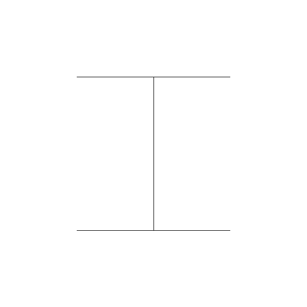

# Distance Transform 
- Based on [Distance Transform of Sampled Functions](http://cs.brown.edu/people/pfelzens/dt/)
- O(N_PIXELS) time complexity
- Modifies buffer implace
- No dynamic memory allocation
- No external dependencies
- C99 compliant
- Can run on embedded microcontrollers

## Usage
Self-explanatory, see [distance_transform.h](./distance_transform.h)
```C
// example 
#include "distance_transform.h"
#define WIDTH 1000
int src_img[WIDTH * WIDTH]; 
int dst_img[(WIDTH + 1) * (WIDTH + 1)]; 
square_distance_transform(dst_img, src_img, WIDTH, WIDTH);
```
## Demo
```
make
./build/test

>>>
saved original.pgm
saved manhattan_distance_transform.pgm
saved square_distance_transform.pgm
```
### Original Image

### Distance Transformed Image

### Manhattan Distance Transformed Image

